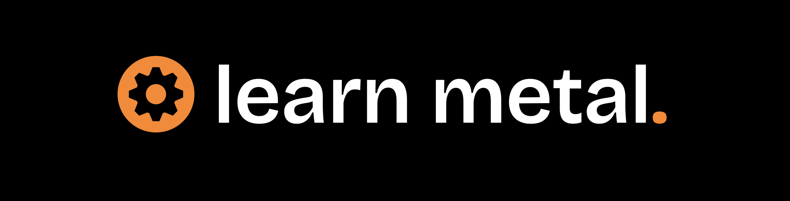

# Learn Metal

Learn Metal is a modern, open-source tutorial site dedicated to teaching Apple’s Metal graphics API from the ground up.

## About

This site provides clear, practical tutorials covering everything from Metal setup to advanced rendering techniques on Apple platforms.

It is built with Jekyll and hosted on GitHub Pages.

## Usage

Feel free to explore the tutorials and learn Metal at your own pace.

## Issues & Feedback

If you find any problems or have suggestions, please open an issue on GitHub.  
Direct code contributions or forks are not encouraged at this time.

## License

MIT License — see [LICENSE](LICENSE) for details.

---

Created by Gabriele Vierti  
[GitHub](https://github.com/theboredprog) | [LinkedIn](https://www.linkedin.com/in/gabriele-vierti-430348324/)
