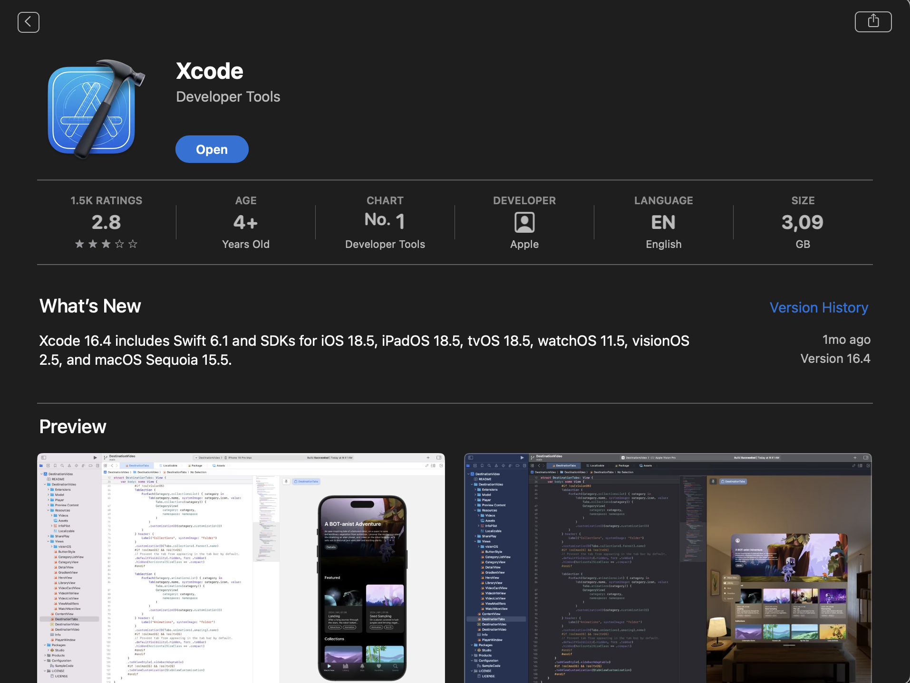
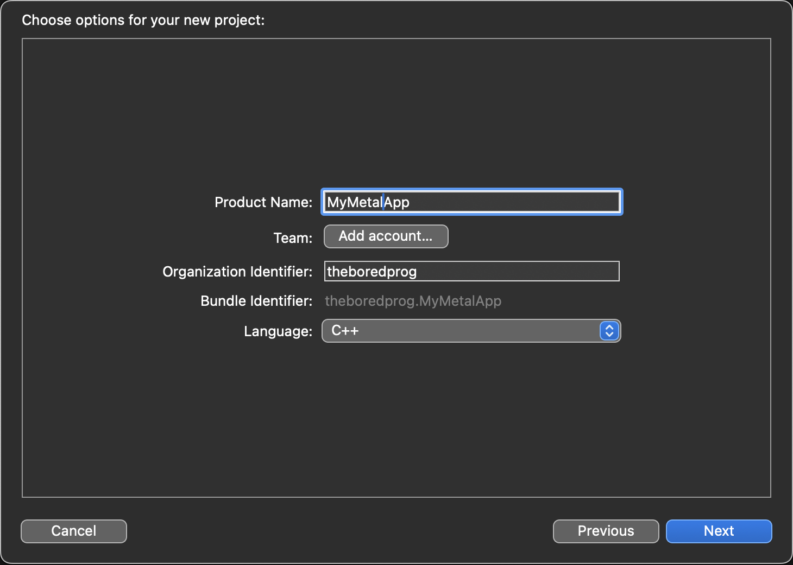
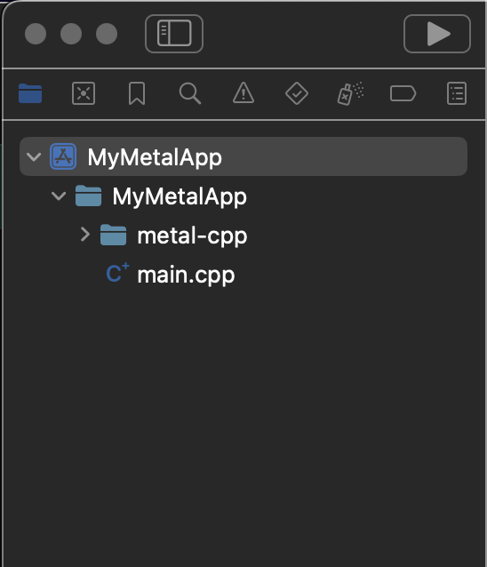
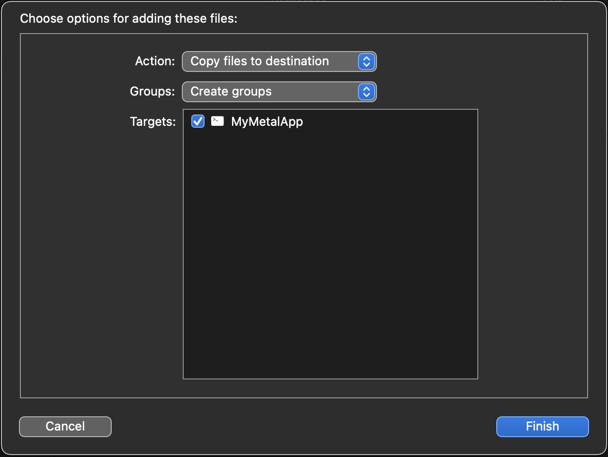
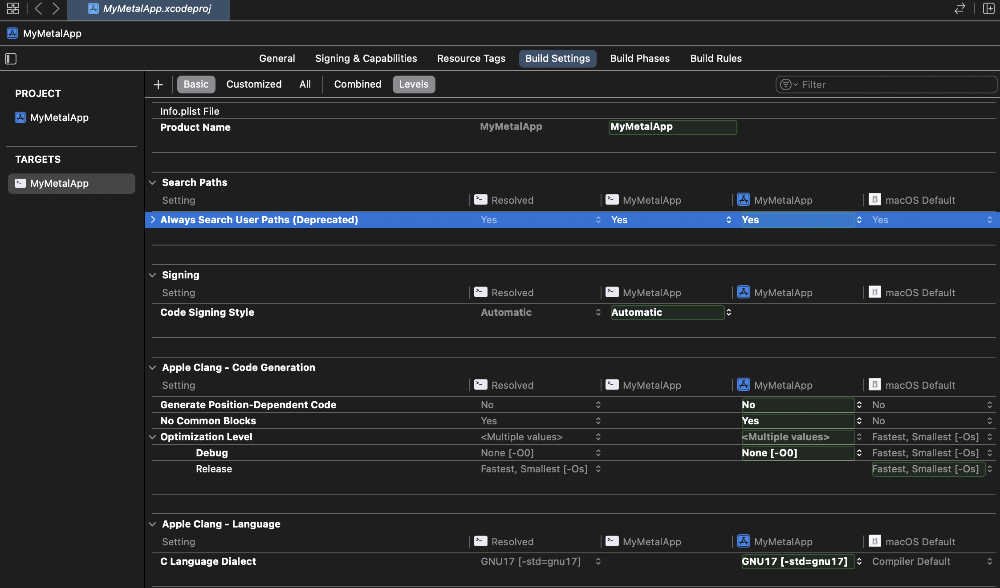
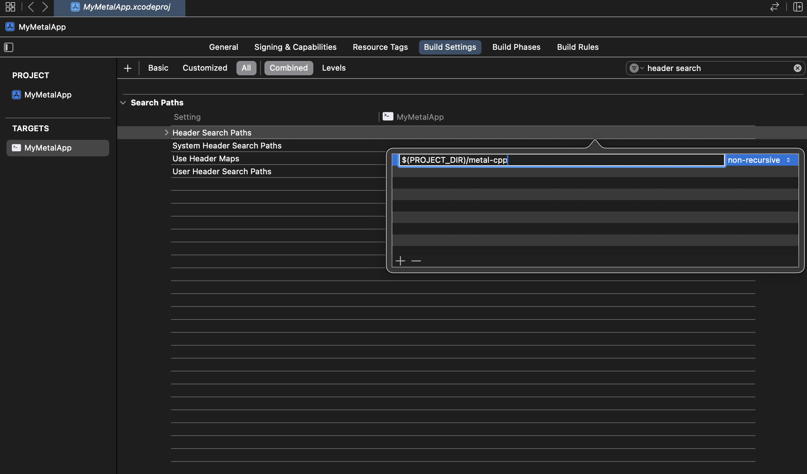

# 01 – Setting Up Your Environment

Welcome to your first steps into Metal development on macOS. This tutorial will help you set up a proper and efficient development environment to start building high-performance graphics applications.

## Why Xcode?

Although it's technically possible to use other editors, **Xcode** is the standard and recommended environment for Apple platforms. Using anything else will quickly lead to frustration and unnecessary complications.

## Why C++?

Metal is traditionally used with [Objective-C](https://en.wikipedia.org/wiki/Objective-C) and [Swift](https://en.wikipedia.org/wiki/Swift_(programming_language)). However, as graphics programmers, we need fine control and maximum performance. That's why **C++** is the preferred choice in the industry today.

To bridge the gap between Objective-C and C++, Apple provides official **C++ bindings** for Metal — allowing modern C++ development while maintaining compatibility with Metal’s API.

We'll also make use of **Objective-C++**, a hybrid that allows both languages to coexist in the same source file.

---

## ✅ Requirements

- A Mac (obviously)
- The latest version of **Xcode** (e.g., _16.4_ at time of writing)
- Basic familiarity with:
  - Swift
  - Objective-C
  - C++
- A sense of curiosity (and perhaps a table to occasionally bang your head against)

---

## Step 1: Install Xcode



If you haven’t already, download Xcode from the [Mac App Store](https://apps.apple.com/us/app/xcode/id497799835) or from the [Apple Developer site](https://developer.apple.com/xcode/).

Ensure you're using **Xcode 9.3 or later**, which includes support for **C++17**, required by Metal’s C++ bindings.

---

## Step 2: Download the Metal C++ Bindings

Download Apple’s official [metal-cpp bindings](https://developer.apple.com/metal/cpp/).

---

## Step 3: Create a New Xcode Project

1. Open **Xcode**
2. Go to: `File → New → Project → macOS → Command Line Tool`
3. Set the product name to something like `MyMetalApp`
4. Select **C++** as the language



This will create a simple terminal-based C++ app as your starting point.

---

## Step 4: Add `metal-cpp` to the Project

Drag and drop the downloaded `metal-cpp` folder into your project.

Make sure:
- You **copy items if needed**
- The **target** is set to your app (`MyMetalApp`)

  


---

## Step 5: Configure Build Settings

We need to tell Xcode where to find the `metal-cpp` headers.

1. Select the **target** (`MyMetalApp`)
2. Go to **Build Settings**
3. Set **Always Search User Paths** to `Yes`



4. Still in **Build Settings**, search for `Header Search Paths`
5. Add the following entry:
```bash
$(PROJECT_DIR)/metal-cpp
```



---

**Work in Progress** — more sections coming soon.

