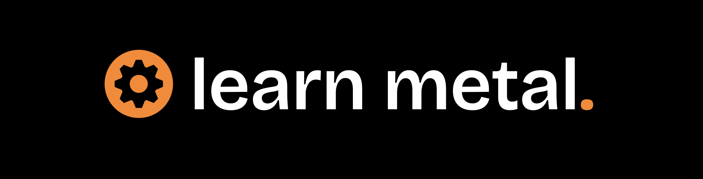

# Welcome to Learn Metal

**Learn Metal** is a personal, open-source project dedicated to teaching Apple’s Metal graphics API — especially its latest version.  
Whether you're diving into graphics programming for fun, study, or your next big idea, feel free to explore this site. I’m building it in my spare time, purely out of passion for coding and sharing what I learn along the way.



Welcome to **Learn Metal**, an open-source tutorial site dedicated to learning and mastering Apple’s Metal graphics API, specifically its newest iteration.
Whether you are interested in learning Metal for academic purposes or just as a hobby for your personal projects, feel free to explore this website i'm making in my free time, purely for the love of programming and sharing what i learn along the way :)

### Website Progress



### A Quick Thank You First

Just as a disclaimer, this site is built using a **modified version** of the [Just the Docs Jekyll theme](https://github.com/just-the-docs/just-the-docs), adapted to best fit the purposes of this project - just to be clear, i'm not a great webdev, so a big thanks goes to them! :)

Now that that's out of the way, I'd like to say that this website probably wouldn’t even exist if it wasn't for the amazing work of [Joey De Vries](http://joeydevries.com/#home) and his legendary [LearnOpenGL](https://learnopengl.com) tutorial series.  
I also owe a lot to other brilliant resources like [vulkan-tutorial](https://vulkan-tutorial.com) and [directxtutorial](http://www.directxtutorial.com/Lesson.aspx?lessonid=9-4-1).

These projects were my go-to study materials for years, and they’re a huge reason why I’m creating this in the first place — to pay it forward.

Massive thanks to all the authors and fellow devs! You all rock!

### “Okay, but why should I follow this tutorial?”

As of **July 18, 2025**, high-quality, beginner-friendly resources on Metal are still hard to come by. Most searches lead you to:

- [https://metaltutorial.com](https://metaltutorial.com) — great, but could go deeper.
- [Apple’s Official Documentation](https://developer.apple.com/documentation/Metal/) — thorough, but tough to piece together if you're just starting out.

I wanted to learn Metal from the ground up *and* help fill this gap in the ecosystem. So this site is both a personal learning journey and a resource for anyone who wants a clearer, more structured way into Metal development.

If it helps you, then mission accomplished.

### Support This Project

**Learn Metal** is — and always will be — completely free.  
If you find it useful and want to support my work, consider buying me a coffee:

<script type="text/javascript" src="https://cdnjs.buymeacoffee.com/1.0.0/button.prod.min.js" data-name="bmc-button" data-slug="theboredprog" data-color="#FFDD00" data-emoji="☕"  data-font="Cookie" data-text="Buy me a coffee" data-outline-color="#000000" data-font-color="#000000" data-coffee-color="#ffffff" ></script>

Thank you!

### Bonus: Simple Tutorial-Writing Reference

This section serves as a quick, practical guide for writing tutorials using Just the Docs features. 
I use it myself too, so feel free to reference it whenever you write content here!

### - Headings

```markdown
# H1
## H2
### H3
#### H4
```

Result:

# H1
## H2
### H3
#### H4

### - Alerts (Callouts)

```
{: .note }
> This is a note.

{: .warning }
> This is a warning.

{: .important }
> This is important!

{: .tip }
> Here’s a tip.
```

Result:

{: .note }
> This is a note.

{: .warning }
> This is a warning.

{: .important }
> This is important!

{: .tip }
> Here’s a tip.

### - Task Lists

```markdown
- [x] Write documentation
- [ ] Build a Metal renderer
```

Result:

- [x] Write documentation  
- [ ] Build a Metal renderer


### - Code Blocks

<pre><code>```swift
let device = MTLCreateSystemDefaultDevice()
```</code></pre>

Result:

```swift
let device = MTLCreateSystemDefaultDevice()
```

### - Navigation and Links

```markdown
[Setting Up Tutorial]({{ site.baseurl }})
[Main Page](https://www.learnmetal.com/)
```

Result: 

- [Setting Up Tutorial]({{ site.baseurl }})
- [Main Page](https://www.learnmetal.com/)

### - Tables

```markdown
| API | Description |
|-----|-------------|
| `MTLDevice` | The GPU abstraction |
| `MTLCommandQueue` | Queue for commands |
```

Result:

| API | Description |
|-----|-------------|
| `MTLDevice` | The GPU abstraction |
| `MTLCommandQueue` | Queue for commands |

### - Buttons

```markdown
[Learn Metal](https://www.learnmetal.com){: .btn .btn-primary}
[GitHub Repo](https://github.com/theboredprog/learnmetal){: .btn }
```

Rendered:

[Learn Metal](https://www.learnmetal.com){: .btn .btn-primary}
[GitHub Repo](https://github.com/theboredprog/learnmetal){: .btn }

### - Inline Code

```markdown
Use `MTLRenderCommandEncoder` to encode your draw calls.
```

### - File Tree (Manual layout)

```markdown
📂 LearnMetal  
├── 📁 docs  
│   ├── 01-setup.md  
│   ├── 02-draw.md  
├── _config.yml
```

### - Images

```markdown

```


### - Emphasis

```markdown
**bold**, *italic*, ***bold and italic***, ~~strikethrough~~
```

Result:

**bold**, *italic*, ***bold italic***, ~~strikethrough~~
